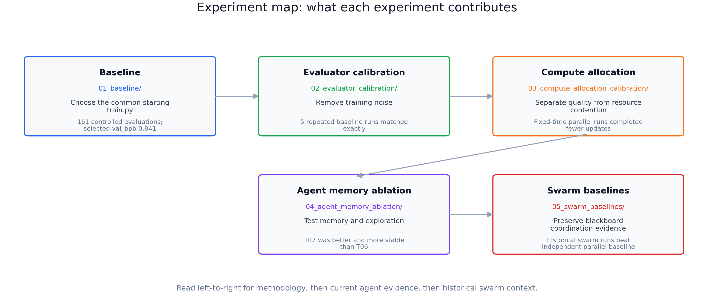

# Experiments

This directory is the empirical spine of Agent Workflow Evaluation Lab. Each
numbered folder is one evidence bundle: the question, what was run, the result,
the caveat, and the file a reviewer should read first.

## Reading Order

1. [`01_baseline/`](01_baseline/) - selects the common starting `train.py`.
2. [`02_evaluator_calibration/`](02_evaluator_calibration/) - proves the evaluator can
   be made deterministic.
3. [`03_compute_allocation_calibration/`](03_compute_allocation_calibration/) - shows
   why fixed-time parallel evaluation can confound quality with compute.
4. [`04_agent_memory_ablation/`](04_agent_memory_ablation/) - tests memory and
   exploration in agent workflows.
5. [`05_swarm_baselines/`](05_swarm_baselines/) - preserves historical blackboard
   swarm evidence.

For a compact table of every experiment bundle, read
[`catalog.md`](catalog.md).

## Experiment Bundles

| Experiment | Role | What was run | Main result | Read first |
| --- | --- | --- | --- | --- |
| [`01_baseline/`](01_baseline/) | Starting point calibration | 161 controlled evaluations of candidate starting models and edits | selected starting model: `val_bpb = 0.841354`, target `<= 0.824` | [`01_baseline/README.md`](01_baseline/README.md) |
| [`02_evaluator_calibration/`](02_evaluator_calibration/) | Deterministic evaluator | fixed-step baseline verification plus memory/no-memory calibration reps | five repeated baseline runs produced identical `val_bpb = 0.811222` | [`02_evaluator_calibration/README.md`](02_evaluator_calibration/README.md) |
| [`03_compute_allocation_calibration/`](03_compute_allocation_calibration/) | Compute fairness | fixed-time CPU scaling, fixed-step pair benchmark, archived 2x2 pilot | fixed-time parallel workers completed fewer optimizer updates; fixed-step held quality constant and exposed latency | [`03_compute_allocation_calibration/README.md`](03_compute_allocation_calibration/README.md) |
| [`04_agent_memory_ablation/`](04_agent_memory_ablation/) | Current agentic signal | 11 valid trials, memory/exploration/seeding variations | shared memory stabilized exploratory search: `T07` best `0.914`, mean `1.049` vs `T06` best `0.933`, mean `1.816` | [`04_agent_memory_ablation/README.md`](04_agent_memory_ablation/README.md) |
| [`05_swarm_baselines/`](05_swarm_baselines/) | Historical swarm context | two-agent blackboard swarm runs and model comparisons | preserved swarm runs reached lower `val_bpb` than independent parallel baseline | [`05_swarm_baselines/README.md`](05_swarm_baselines/README.md) |

## Vocabulary

- **Experiment**: one evidence bundle under `experiments/`.
- **Trial**: one valid configuration inside an experiment. The agent-memory
  ablation experiment uses a compact `T01`-`T11` index.
- **Wave**: an execution batch inside an experiment. It is scheduling metadata, not a
  public milestone.
- **Successful training attempt**: a run that produced a valid evaluator result,
  not a separate experiment.
- **Confirmatory run**: a future run with fixed-step evaluation, preserved raw
  logs, and a pre-registered success threshold.

## Completeness

The public tree keeps curated summaries, result tables, and figures. Raw run
directories, transient agent workspaces, local datasets, and large private logs
are intentionally left out unless an experiment explicitly says otherwise.
