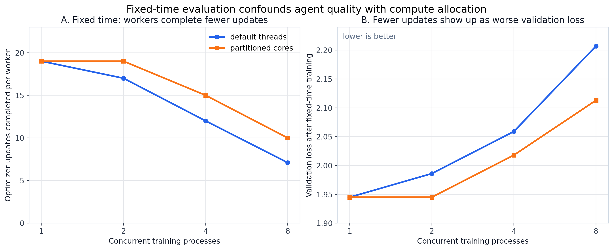
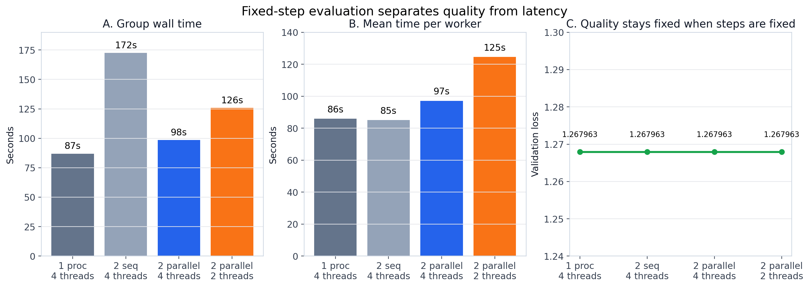
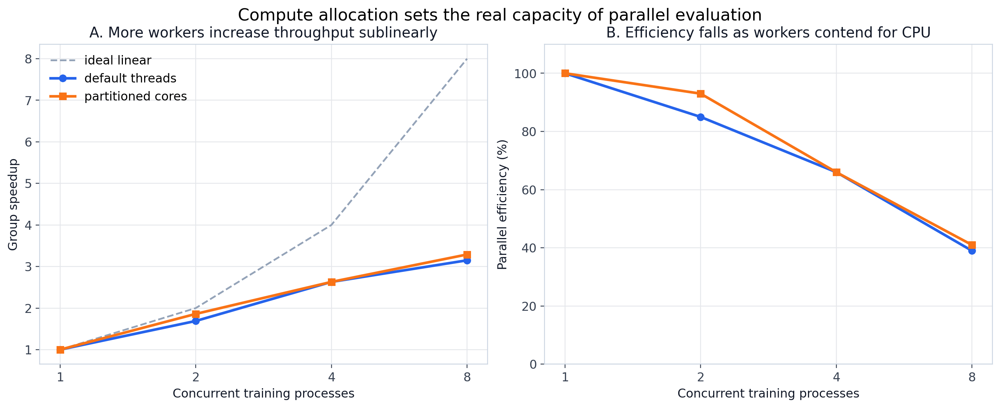

# Compute Allocation Calibration

**Status**: archived calibration study
**Period**: April 2026
**Purpose**: separate agent workflow quality from the compute budget each
training worker actually receives.

This study is CPU-only, but the methodological lesson generalizes to GPU/CPU
allocation: before comparing agent workflows, the evaluator must control whether
parallel workers receive equal training compute or merely equal wall-clock time.

## Central Message

The first 2x2 agent pilot mixed two effects:

1. agent workflow quality: did parallel or memory-enabled agents make better
   choices?
2. compute allocation: did parallel training jobs receive fewer optimizer
   updates because they shared the same CPU?

The calibration shows that compute allocation was a real confound.

- Under **fixed-time** evaluation, more concurrent workers complete fewer
  optimizer updates and validation loss gets worse.
- Under **fixed-step** evaluation, all workers complete the same number of
  optimizer updates, so validation loss stays fixed; the cost moves to
  wall-clock latency.

Therefore, parallel agent evaluations should use fixed-step evaluation or
explicit compute accounting. Otherwise the experiment can mistake hardware
contention for poor agent decisions.

## What It Contains

| path | role |
| --- | --- |
| [`results/fixed_time_cpu_scaling/`](results/fixed_time_cpu_scaling/) | N=1,2,4,8 fixed-time CPU scaling benchmark |
| [`results/fixed_step_cpu_pair_benchmark/`](results/fixed_step_cpu_pair_benchmark/) | N=2 fixed-step benchmark showing quality is equalized but workers slow down |
| [`results/figures/`](results/figures/) | current paper-style figures plus retained historical pilot plots |
| [`results/compute_allocation_calibration_summary.md`](results/compute_allocation_calibration_summary.md) | historical report tying the compute confound back to the first 2x2 agent pilot |
| [`results/raw_2x2_agent_pilot/`](results/raw_2x2_agent_pilot/) | raw JSON from the original 2x2 agent pilot |

## Key Figures

**Figure 1**: with a fixed wall-clock budget, increasing concurrent training
processes reduces optimizer updates per worker. Validation loss worsens at the
same time. This is the core confound.

**Figure 2**: when each worker is forced to complete 300 optimizer updates,
validation loss is identical across sequential and parallel settings. Parallel
execution changes wall-clock time, not quality.

**Figure 3**: parallel evaluation increases group throughput, but sublinearly.
Efficiency falls as workers contend for CPU resources.

## Numbers To Remember

Fixed-time default CPU policy:

| concurrent processes | optimizer updates per worker | validation loss |
| ---: | ---: | ---: |
| 1 | 19.0 | 1.945 |
| 2 | 17.0 | 1.986 |
| 4 | 12.0 | 2.059 |
| 8 | 7.1 | 2.207 |

Fixed-step N=2 follow-up:

| condition | group wall time | mean worker time | validation loss |
| --- | ---: | ---: | ---: |
| 2 sequential workers, 4 threads | 172.44s | 85.10s | 1.267963 |
| 2 parallel workers, 4 threads | 98.48s | 97.15s | 1.267963 |

The parallel pair finishes the group workload 1.75x faster, but each worker is
14.2% slower. Quality is unchanged because the optimizer-update count is fixed.

## What This Means For Later Agent Experiments

Use this study as the reason for:

- fixed-step evaluation;
- serialized or CPU-aware training evaluation when comparing agent modes;
- separate reporting of agent deliberation time and evaluator training time;
- explicit compute accounting before interpreting parallel-agent quality.

This study does not prove whether parallel agents are better or worse. It proves
that the original fixed-time comparison could not answer that question cleanly.
